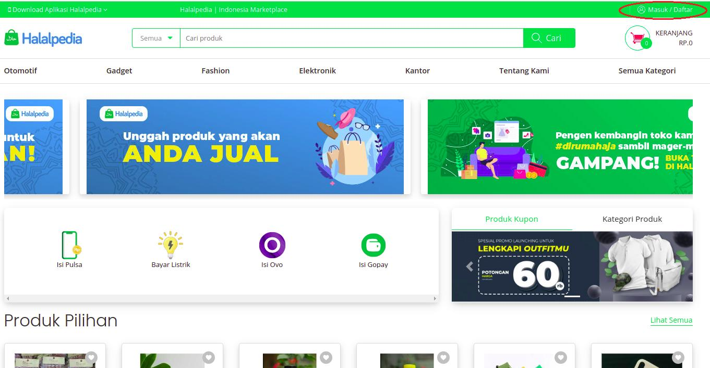
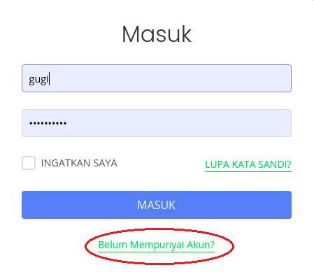
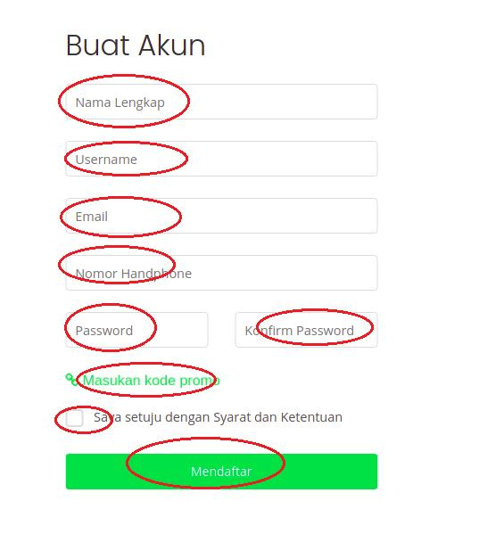
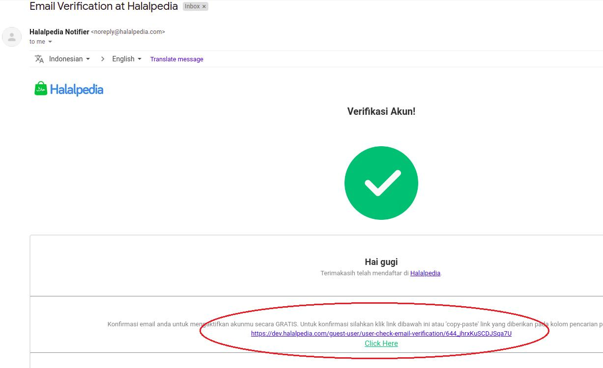
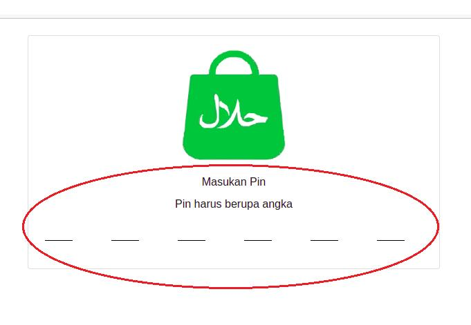

## register with email

_pendaftaran akun baru verifikasi email_

1. Buka web browser dan ketik [halalpedia.com](https://www.halalpedia.com)

2. klik **'masuk/daftar'** pada header

   

3. Pop up akan muncul, klik **'Belum mempunyai akun'**

   

4. Isi field pada form buat akun, lalu checklist 'Saya setuju dengan Syarat dan Ketentuan'

   

5. Klik **'Mendaftar'**

6. Cek inbox email yang di daftarkan, lalu klik link verifikasi atau klik **'click here'**

   

7. Jika berhasil akan direct ke halaman membuat **PIN**

   

8. isikan **PIN** tersebut (harus berupa angka)

9. Akun baru sudah dapat digunakan

## register with otp activation

_pendaftaran akun baru verifikasi OTP_

1. Download aplikasi Halalpedia Adroid/iOS

2. Buka aplikasi Halalpedia

3. Klik menu **'Akun'**

4. Klik **'Daftar'**

5. Isi field pada form pendaftaran, klik 'Register'

6. klik **'Validasi'** untuk kirim verifikasi kode OTP ke nomor whatsapp

7. Isi field kode verifikasi

8. Klik **'Submit'**

9. Jika berhasil akan direct ke halaman login

10. Akun baru sudah dapat digunakan
