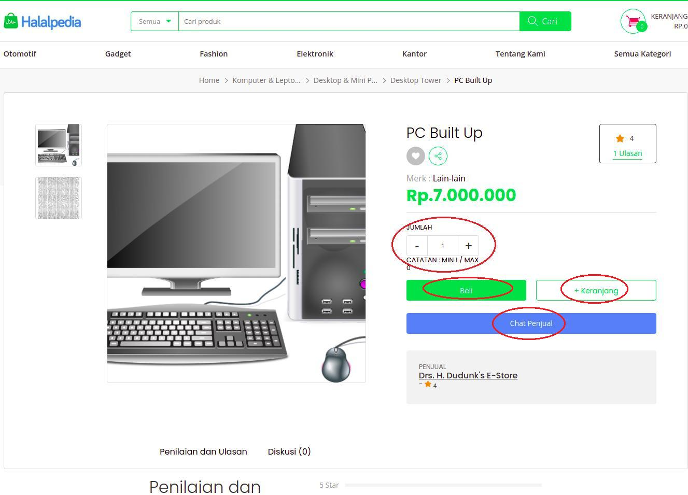
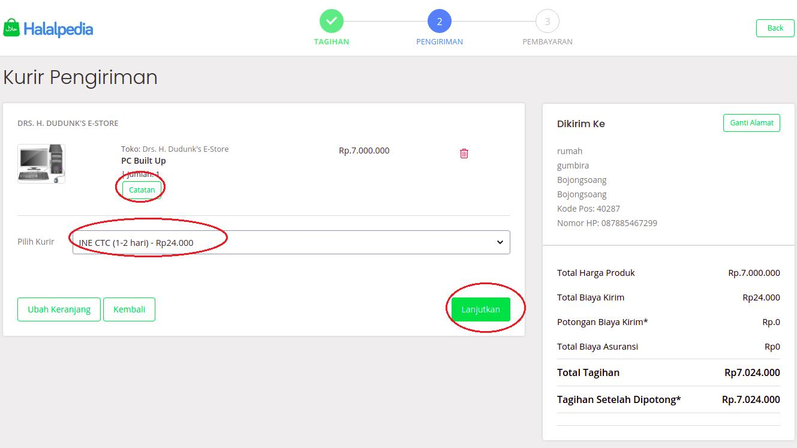

## Order Produk

_flow pembeli saat pemesanan barang_

**_kondisi sudah login_**

1. pilih produk yang akan dibeli

2. tentukan jumlah barang dengan klik tanda **'+'** atau **'-'**

3. klik **'Beli'** untuk langsung ke tahap pemilihan kurir pengiriman

4. klik **'Keranjang'** untuk di simpan ke keranjang dan dapat menambahkan produk lain, jika sudah klik _'checkout'_

5. isi form alamat pengiriman

   

   - atau dapat langsung isikan lokasi di maps

   

6. pilih kurir pengiriman

7. klik **'Lanjutkan'**

8. pilih salah satu metode pembayaran

9. klik **'Konfirmasi Pembayaran'**

10. akan muncul cara pembayaran yang dipilih

    

---

---

---

**_kondisi tidak login_**

1. pilih produk yang akan dibeli

2. tentukan jumlah barang dengan klik tanda **'+'** atau **'-'**

3. klik **'Beli'** untuk langsung ke tahap pemilihan kurir pengiriman

4. klik **'Keranjang'** untuk di simpan ke keranjang dan dapat menambahkan produk lain, jika sudah klik **'checkout'**

5. akan muncul alert **"Silahkan login untuk belanja"**

6. klik **'Masuk/daftar'**

7. isi data username dan password

8. klik **'Masuk'**

9. pilih kurir pengiriman

10. klik **'Lanjutkan'**

11. pilih salah satu metode pembayaran

    

12. klik **'Konfirmasi Pembayaran'**

13. muncul cara pembayaran yang dipilih

    
