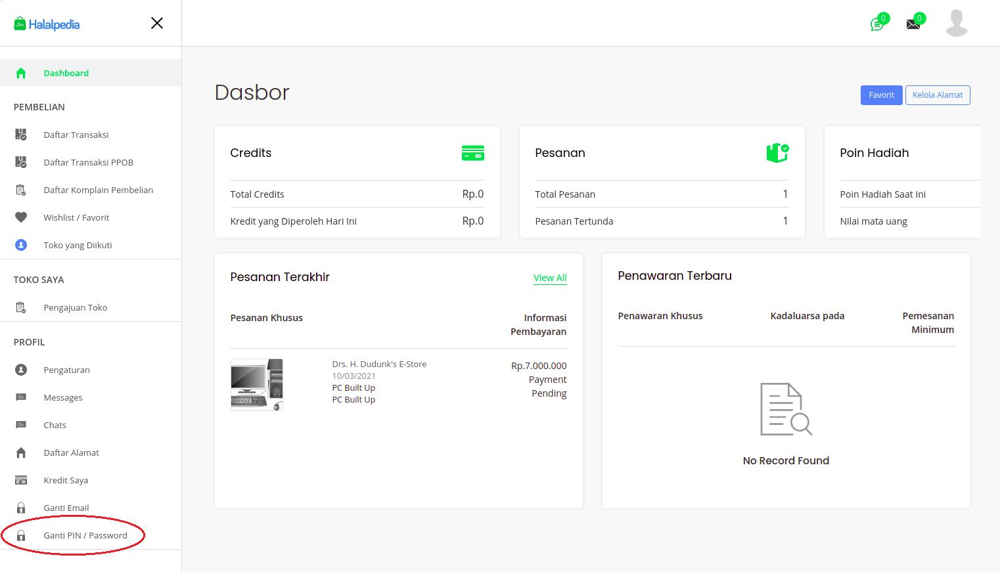
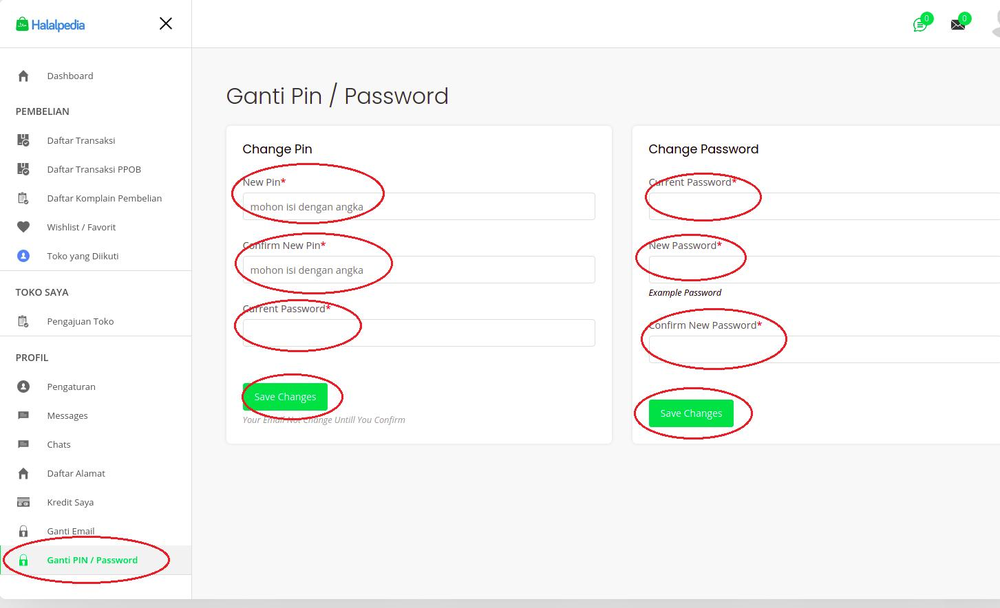

## Ganti PIN/Password

1. Login

2. klik **'(nama akun)'** pada header sebelah kanan

3. klik **'Dasbor'**

4. klik **'Ganti PIN/Password'**

5. isi form, klik **'Save Change'**

6. akan muncul alert _'Change PIN Succesfully'_ atau _'Change Password Succesfully'_
