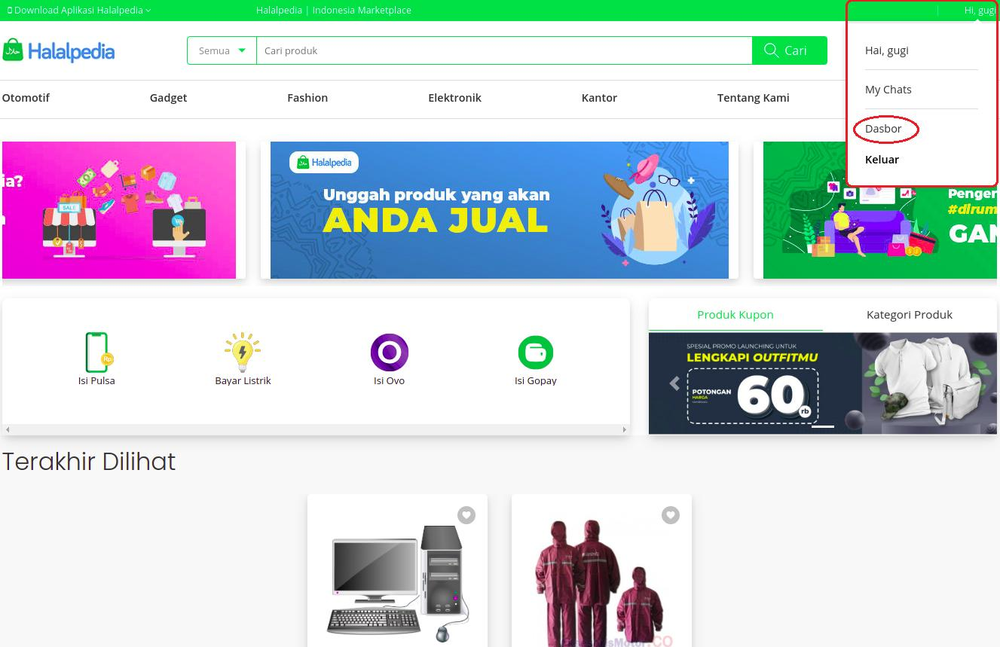
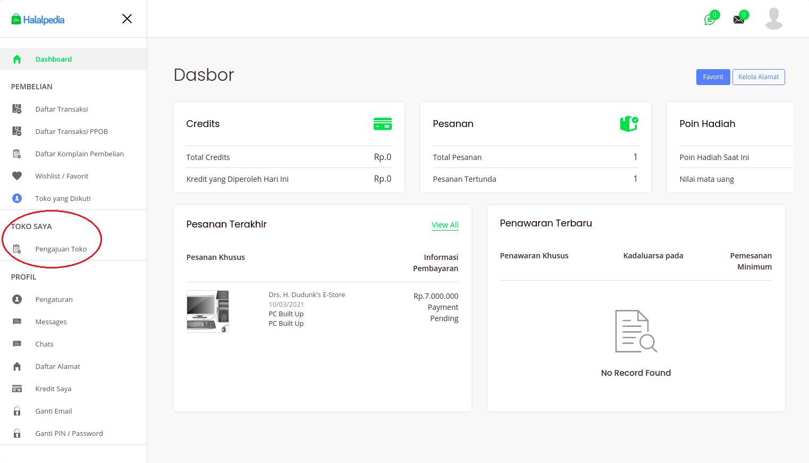
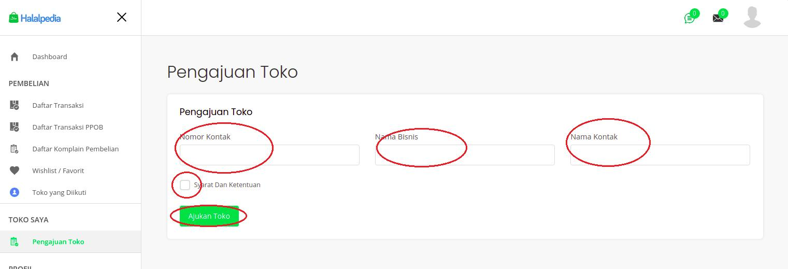
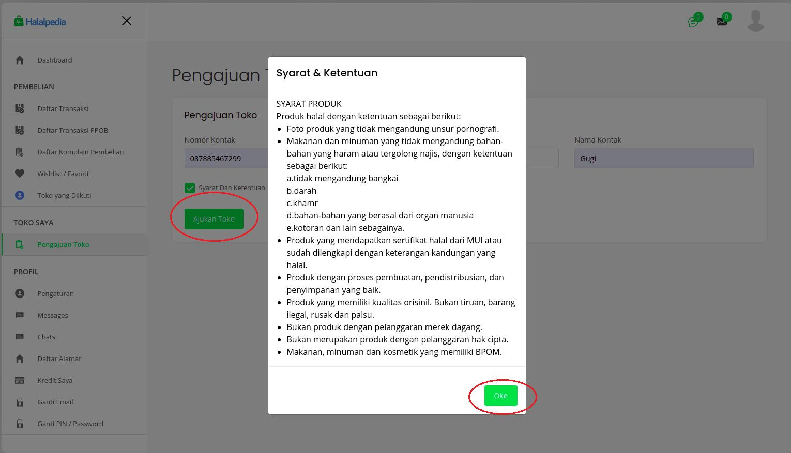
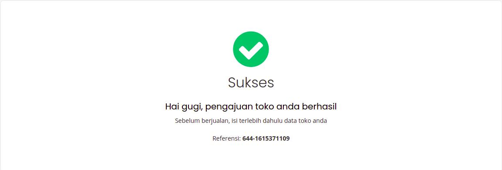
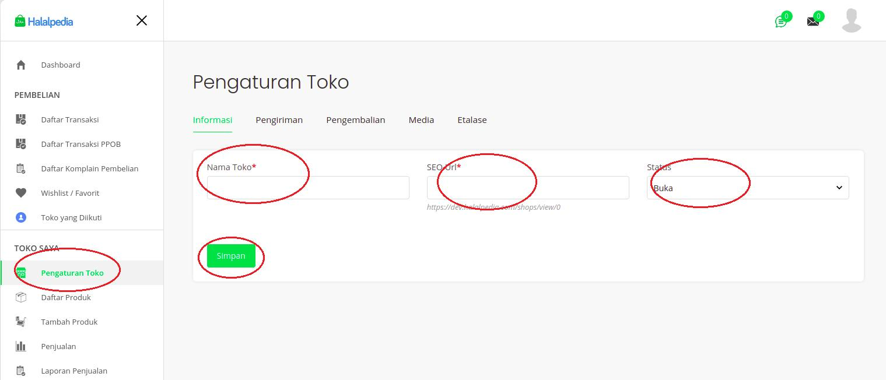
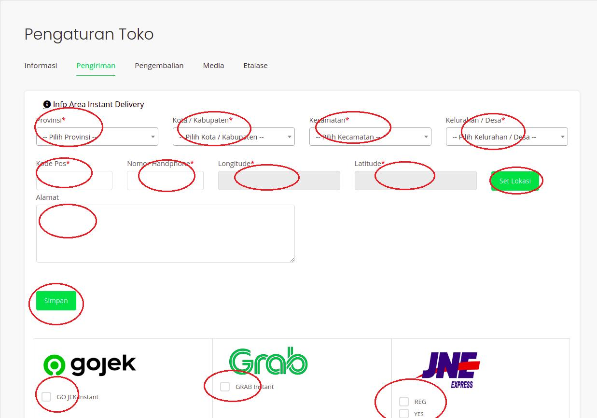
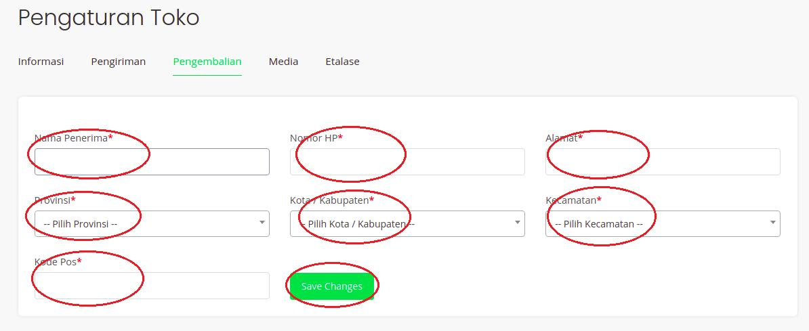
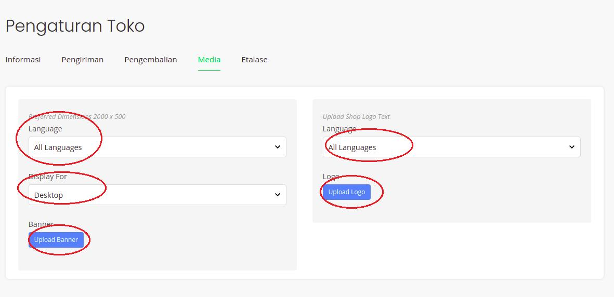
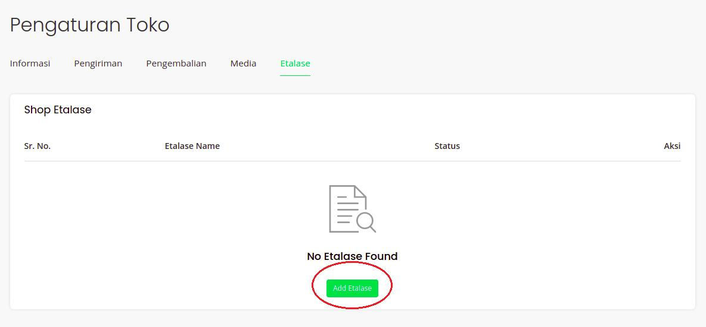

## Buat Toko

**fitur user akan memjadi seller/buka toko**

1. Login

2. klik **'(nama akun)'** pada header sebelah kanan

3. klik **'Dasbor'**

4. pada side bar kolom **Toko Saya**, klik **'Pengajuan Toko'**

5. isi form pengajuan toko

6. checklist **Syarat dan Ketentuan**

7. klik **'Ajukan Toko'**

8. ikuti petunjuk untuk mengisi alamat toko dan lain-lain pada sidebar **Toko Saya**

9. isikan informasi toko dan klik **'Simpan'**

10. isikan informasi pengiriman toko, alamat toko, lokasi, kurir dan klik **'Simpan'**

11. isikan informasi alamat pengembailian toko dan klik **'Save Changes'**

    

12. isikan banner dan logo sebagai optional dan klik **'Upload Banner'** atau **'Upload Logo'**

    

13. optional tambah etalase dan klik **'Add Etalase'**

    
