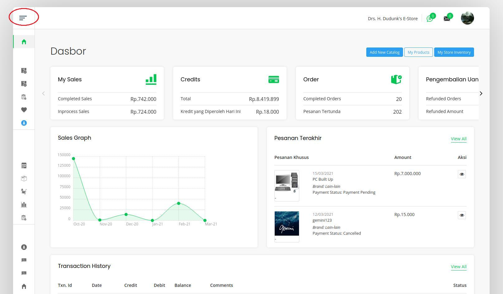
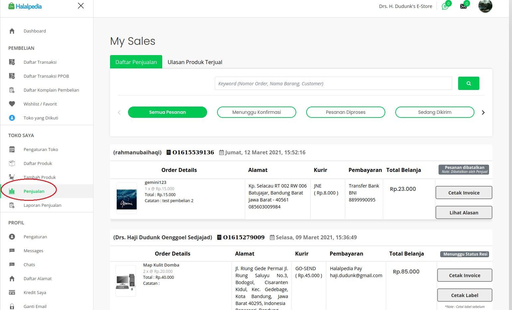
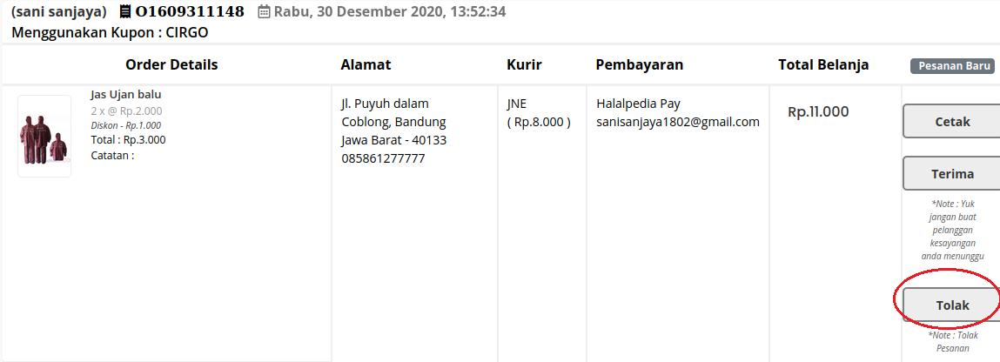
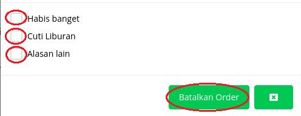
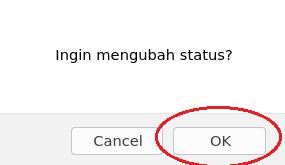
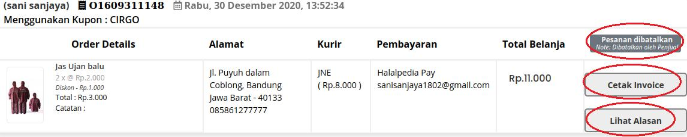

## Penolakan Order

_fitur untuk seller menolak pemsanan_

1. login sebagai **seller**

2. klik **'Dasbor'**

3. klik tombol **'(Humburger Button)'** pada sidebar dasbor

4. klik **'Penjualan'**

5. klik Tombol **'Tolak'**

6. checklist alasan penolakan

7. klik **'Batalkan Order'**

8. klik **'OK'** untuk merubah status pesanan

9. status akan berubah.

   

   - klik **'cetak invoice'** untuk cetak invoice
   - klik **'lihat alasan'** untuk melihat alasan penolakan

10. selesai.
