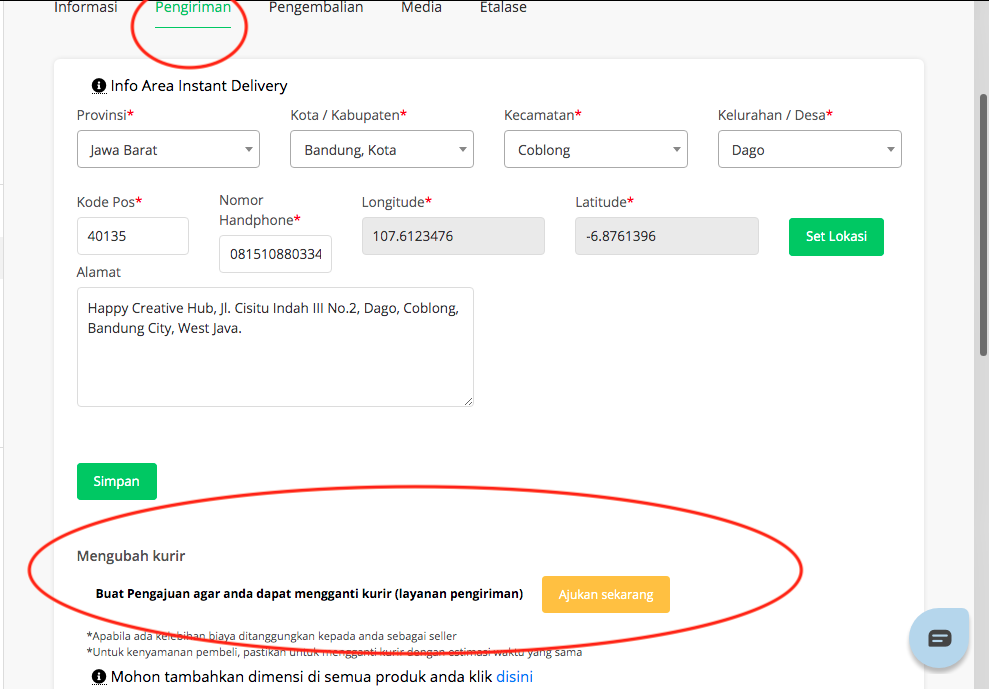
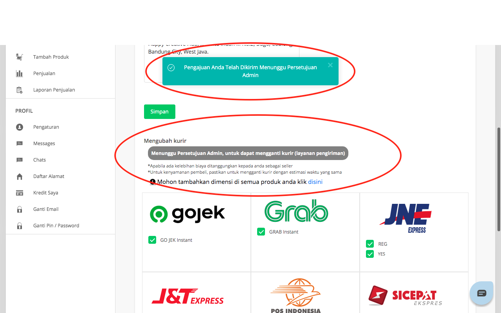
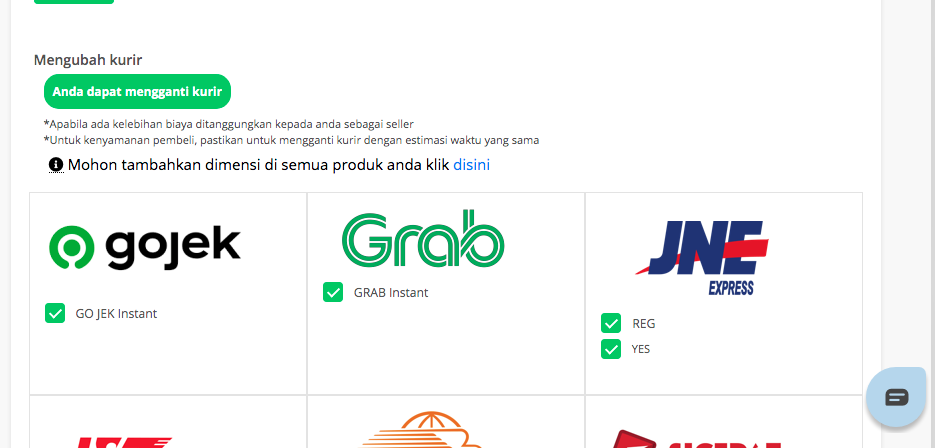
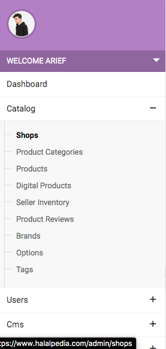
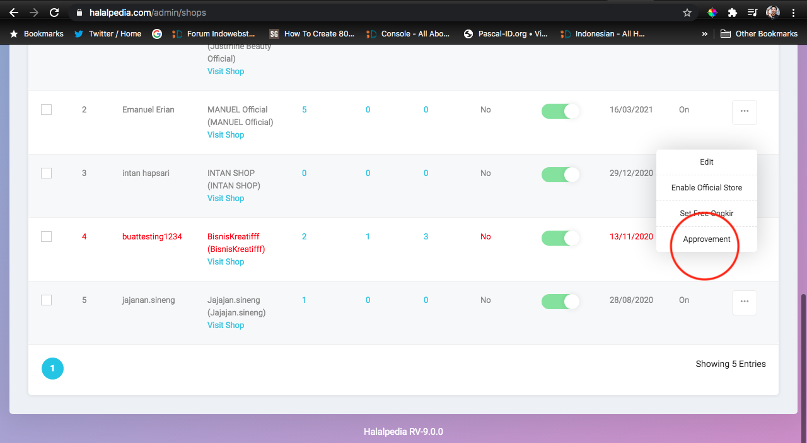

## Ubah Kurir Seller Section

_fitur untuk mengubah kurir pada ordera yang sedang berjalan dari sisi seller_

1. Login
2. Masuk menuju dashboard user
3. Pilih/klik menu pengaturan toko
4. Klik tab pengiriman
5. Klik ajukan pengajuan ganti kurir
   
6. Tampilan setelah melakukan pengajuan
   
7. Tunggu admin melakukan approval
8. Tampilan Ketika Sudah di approve
   

## Ubah Kurir Admin Section

_fitur untuk mengubah kurir pada ordera yang sedang berjalan dari sisi admin_

1. Masuk ke link (https://halalpedia.com/admin/admin-guest/login-form)
2. Pilih/Klik label 'shops' pada seperti tampilan dibawah ini
   
3. Toko dengan text merah menunjukan sedang melakukan pengajuan, klik pada approval label
   
4. Selesai
